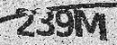
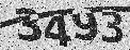

# Captcha-Recognition

## Package
|Name|Version|
|----|----|
|tensorflow|2.4|
|tensorflow-gpu|2.4|
|keras|2.4|
|scipy|2.0|
|PIL|7.0|

## Training Data
### Preprocess the training data from mat format to png format
 

### Label
Each Letter has 19 kinds of possiblity, including:
- digit: 2, 3, 4, 5, 7, 9
- alphabet: A, C, F, H, K, M, N, P, Q, R, T, Y, Z

-----

## Result
### One word Accuracy: 98.9%
- The Accuracy of each letter
### Four word Accuracy: 96.2%
- The Accuracy of each captcha
